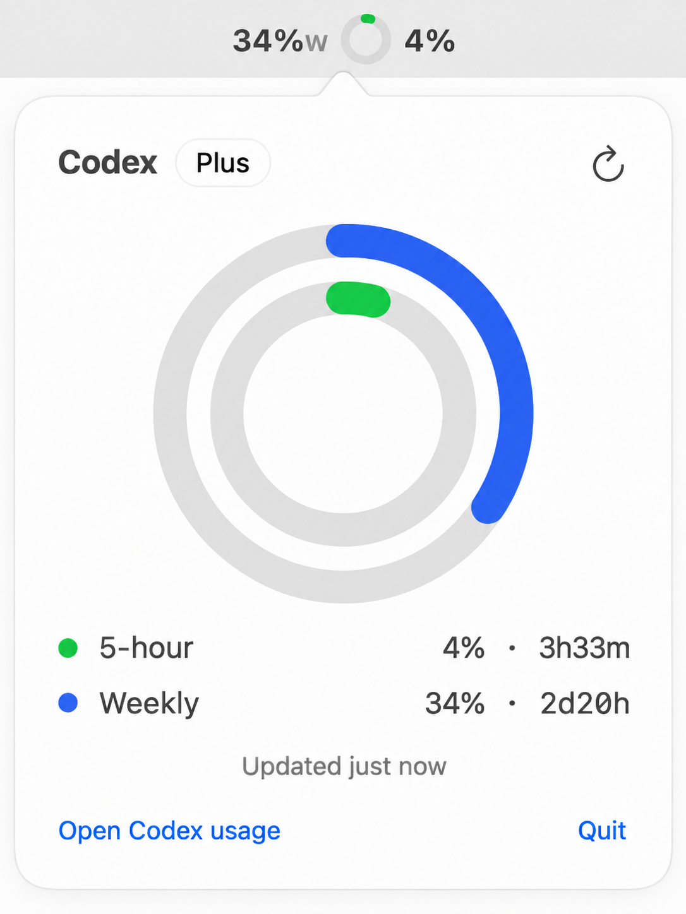

# CodexBar

Your Codex limits, in the menu bar.

<p align="center">
  
</p>

I built this because I kept opening a browser tab to check my Codex limits, and that was stupid.

5-hour ring. Weekly ring. Done.

## Run

```bash
git clone https://github.com/yourarnav/CodexBar.git
cd CodexBar
./install.sh
```

Needs macOS 14 or later, Xcode 26 or later, Codex signed in once. Open Codex, open CodexBar. Quit Codex, it quits too.

MIT. Free forever. Not affiliated with OpenAI.
